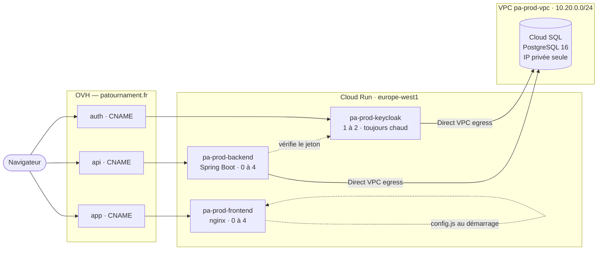
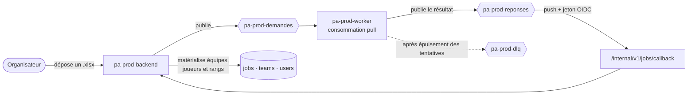
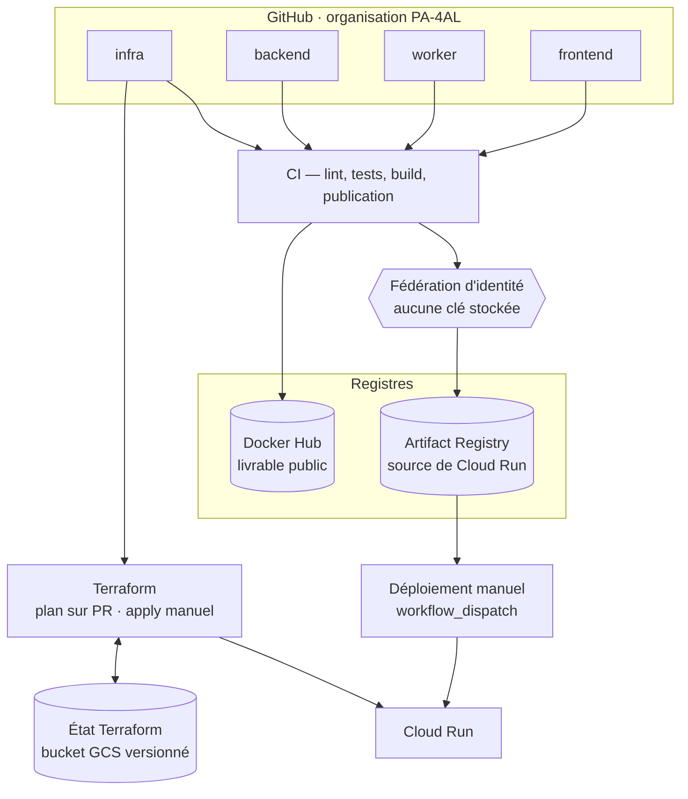

# Architecture de production

## Vue d'ensemble

Diagrammes en Mermaid : ils sont rendus tels quels par GitHub et par les IDE
JetBrains, donc lisibles là où on lit le code. Un schéma qui vit à côté du code
suit ses évolutions ; une image exportée ne les suit pas.

Deux points que le schéma ne dit pas seul :

- **le frontend n'est pas attaché au VPC** — il ne parle qu'au navigateur. Sa
  configuration est écrite au démarrage du conteneur dans `/config.js`, ce qui
  permet d'utiliser la même image en développement et en production ;
- **Keycloak garde une instance chaude** : un démarrage à froid de 25 s sur
  l'écran de connexion est la pire première impression possible.

## Décisions et justifications

### Cloud Run plutôt que Kubernetes

Quatre conteneurs sans état, un trafic de démonstration : GKE coûterait le prix
d'un plan de contrôle et d'au moins un nœud en permanence. Cloud Run facture à
l'usage, scale à zéro et fournit HTTPS et certificats gratuitement.

### Cloud SQL en IP privée + Direct VPC egress

C'est la décision structurante de l'infrastructure. Les alternatives :

| Option | Problème |
|---|---|
| IP publique + réseaux autorisés | Les IP de sortie de Cloud Run ne sont pas fixes → il faudrait autoriser `0.0.0.0/0` |
| Connecteur d'accès VPC serverless | ~8 $/mois de machines de connecteur, pour le même résultat |
| Connecteur Cloud SQL (socket Unix) | Impose une bibliothèque de socket factory côté JDBC — à faire deux fois (Spring **et** Keycloak) |
| **IP privée + Direct VPC egress** | Aucun surcoût, une URL JDBC standard des deux côtés, base jamais exposée |

La base n'a donc **aucune IP publique** : elle n'est joignable que depuis le VPC.

### Keycloak dans une image « optimisée »

`kc.sh build` est exécuté au moment du build de l'image (augmentation Quarkus),
et le realm + le thème y sont embarqués. Deux conséquences : le démarrage passe
d'environ une minute à ~25 s (ce qui rend le scale-to-zero envisageable), et la
configuration d'authentification est versionnée dans git au lieu d'être cliquée
dans une console.

`min-instances = 1` en production : un cold start sur l'écran de connexion est
la pire première impression possible. En `dev`, la valeur est 0.

### Worker : pull Pub/Sub, pas polling de base de données

La spec initiale (§7) prévoyait une table `jobs` pollée par le worker. Le code
implémenté consomme **Pub/Sub** (`worker/src/queue/consumer.rs`), ce qui est
meilleur : pas de requête inutile toutes les 500 ms sur la base, une file de
rebut et une politique de reprise fournies par le service, et un worker qui ne
touche pas du tout à la base de données (les fichiers Excel circulent en base64
dans le message, limite 10 Mo).

Contrainte : Cloud Run exige qu'un service écoute sur `$PORT`. Le worker expose
donc une sonde HTTP minimale (`worker/src/health.rs`), et tourne avec
`min-instances = 1` et CPU allouée en permanence — sinon il ne consommerait
jamais la file.

Les réponses reviennent au backend par un abonnement **push** authentifié par
jeton OIDC : le backend n'a rien à poller, et l'endpoint peut vérifier l'appelant.

### Une seule image par service, quel que soit l'environnement

Le frontend lisait ses URLs dans des variables `VITE_*` figées à la compilation :
il fallait donc une image par environnement. La configuration est désormais
injectée au démarrage du conteneur (`/config.js` généré par
`docker/40-app-config.sh`). La même image validée en test est celle qui part en
production.

### Ce que Terraform gère (et ne gère pas)

Terraform décrit **l'infrastructure** : réseau, base, files, services, IAM,
secrets, domaines. Il ne décide **pas** de la version d'image déployée : ce champ
est en `ignore_changes` et appartient à la pipeline de déploiement. Sans cette
séparation, chaque `terraform apply` ferait régresser la production.

## Flux d'une authentification

1. Le navigateur charge `https://app.<domaine>` (nginx) puis `/config.js`, qui
   fournit les URLs d'API et de Keycloak.
2. `keycloak-js` redirige vers `https://auth.<domaine>` (flux Authorization Code
   + PKCE), éventuellement via Google ou Discord.
3. Keycloak renvoie un JWT contenant `realm_access.roles`.
4. Le frontend appelle `https://api.<domaine>` avec `Authorization: Bearer …`.
5. Le backend valide la signature via l'issuer configuré et convertit les rôles
   du realm en autorités `ROLE_player`, `ROLE_organizer`, `ROLE_admin`.

## Flux d'un import Excel

1. `POST /api/v1/teams/import` (rôle `organizer` ou `admin`) avec
   `{tournamentType, fileBase64}`. Le backend trace une ligne `jobs`, publie
   `{task_id, task_type: "import_excel", payload: {tournament_type, file_base64}}`
   sur `topic-demandes`, et répond immédiatement le job en `processing`.
2. Le worker consomme, parse le fichier selon le type de tournoi
   (`esport_5v5` ou `football_11v11`, cf. `worker/src/parser/`), regroupe les
   joueurs par équipe et publie sa réponse sur `topic-reponses`.
3. Pub/Sub pousse la réponse sur `POST /internal/v1/jobs/callback`, qui met à jour
   le statut du job et enregistre le résultat.
4. Le frontend suit l'avancement via `GET /api/v1/jobs/{id}` (`pending` →
   `processing` → `done` / `failed`, avec le message d'erreur du worker).
5. Après 5 échecs, le message part en file de rebut plutôt que de boucler.

### Sécurité de l'endpoint de callback

`/internal/v1/jobs/callback` est exposé publiquement (Pub/Sub doit l'atteindre)
mais protégé par une chaîne de sécurité distincte de celle de l'API :

| Contrôle | Où |
|---|---|
| Signature du jeton, émetteur `accounts.google.com` | `SecurityConfig.internalFilterChain` |
| Audience = URL exacte du callback | idem (configurée dans l'abonnement push) |
| Adresse du compte de service appelant | `JobCallbackController.verifyCaller` |

Les deux émetteurs (Google pour le callback, Keycloak pour l'API) ont chacun
leur décodeur : ils ne doivent surtout pas être confondus.

Le chemin contient un segment `v1` bien que l'endpoint soit hors API publique :
la résolution de version d'API du backend (`usePathSegment(1)`) valide le 2e
segment de **toutes** les routes, et un segment illisible comme version fait
répondre 400 avant d'atteindre le controller. Sans jeton, Spring Security masque
le problème en répondant 401 en amont — d'où un test authentifié dédié côté
backend.

Codes de retour choisis en connaissance du comportement de Pub/Sub : `2xx`
acquitte, `4xx` abandonne le message, `5xx` demande une nouvelle livraison. Un
message illisible ou destiné à un job inconnu renvoie donc un code final — sinon
il serait rejoué jusqu'à saturer la file de rebut. La reprise reste idempotente :
un job déjà `done` ou `failed` ignore une seconde livraison.

### Contrainte de taille

Les fichiers circulent en base64 **dans le message** : la limite Pub/Sub de 10 Mo
par message est vérifiée côté backend (`413` au-delà de ~9 Mo de base64, soit
~6,7 Mo de fichier). Au-delà, il faudra passer par un bucket Cloud Storage et ne
transmettre que l'URL — ce que la colonne `jobs.file_url` prévoit déjà.

## Chaîne de livraison

Deux registres, deux usages : Artifact Registry alimente Cloud Run, Docker Hub rend
le livrable consultable publiquement. La même image est poussée aux deux.

Les images sont déployées **par leur empreinte** (`sha-<court>`, immuable), et
Terraform ne décide jamais d'une version d'image : il ignore ce champ, sinon un
`apply` ramènerait la révision précédente (cf. `docs/adr/0006`).

## Budget de connexions à la base

La ressource la plus rare de cette infrastructure, et celle qui a provoqué la seule
panne de production. Cloud Run démultiplie les pools : chaque instance a le sien, et
pendant un déploiement l'ancienne révision et la nouvelle tournent ensemble. **Le
pire cas n'est donc pas le trafic de pointe, c'est le déploiement.**

| Consommateur | Instances | Pool | Révisions | Connexions |
|---|---|---|---|---|
| `pa-prod-backend` | 4 | 3 | ×2 | 24 |
| `pa-prod-keycloak` | 2 | 5 | ×2 | 20 |
| Exploitation — bastion, WebStorm, psql | — | — | — | 8 |
| Réserve PostgreSQL — rôles privilégiés | — | — | — | 3 |
| **Total** pour `max_connections = 60` | | | | **55** |

Une précondition Terraform refuse un plan dont le budget est intenable : augmenter
`max_instances` sans revoir les pools ne peut plus reproduire la panne
(cf. `docs/adr/0009`).

## Limites connues

- Base **mono-zone**, sans haute disponibilité (le doubler doublerait la facture).
- Sauvegardes quotidiennes conservées 7 jours, **sans** restauration à un instant
  précis (la journalisation WAL coûte du stockage).
- Un seul environnement réellement déployé (`prod`) ; le code IAC supporte `dev`
  mais ne le déploie pas, pour ne pas doubler les coûts.
- Pas de CDN devant le frontend (le domain mapping Cloud Run suffit ; un load
  balancer global coûterait ~18 $/mois).
